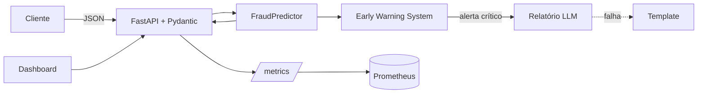
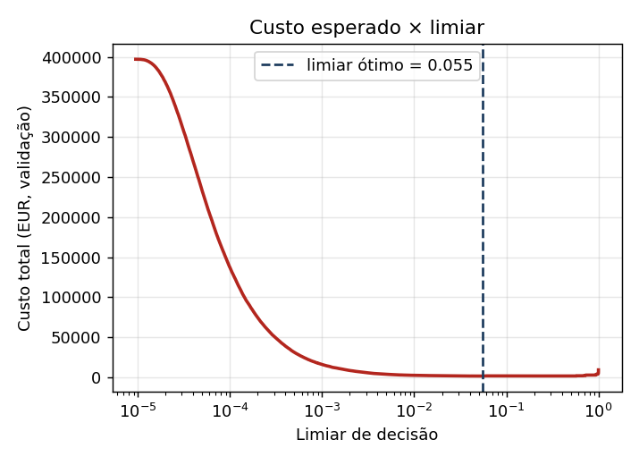
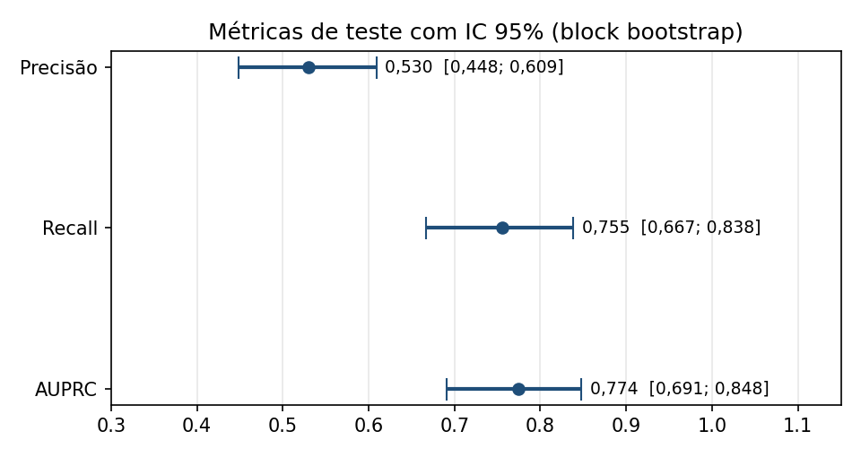

# FraudGuard

Microsserviço de detecção de fraude em tempo real, com Early Warning System e relatórios inteligentes gerados por LLM.

Recebe uma transação, devolve em menos de 1 ms a probabilidade de fraude, a decisão (`APROVADO` ou `SUSPEITO`) e, se pedido, os fatores que pesaram. Em paralelo, monitora o fluxo e avisa quando algo foge do normal: ataque de teste de cartão, pico de suspeitas, drift de dados, lentidão.

| Resultado (teste temporal) | |
|---|---|
| Redução do custo total de fraude | **76,5%** |
| Fraudes barradas | **75,5%** em quantidade, **86,9%** em valor |
| Clientes legítimos incomodados | **0,111%** (1 em 900) |
| AUPRC | **0,774** (aleatório: 0,0017) |
| Latência de inferência p99 | **0,84 ms** |
| Throughput por réplica de 1 vCPU | **~22 mil tx/min** |
| Testes | **122**, cobertura de **91%** |

> **Sobre os dados.** O dataset do Kaggle não estava acessível no ambiente onde este projeto foi desenvolvido. Os números acima vêm de dados sintéticos que reproduzem o schema e o perfil estatístico do dataset ULB (284.807 transações, 492 fraudes, duplicatas, sazonalidade, caudas pesadas, fraudes camufladas). Coloque `creditcard.csv` em `data/raw/` e o mesmo pipeline treina com os dados reais, sem mudar nenhuma linha de código.

---

## Como rodar com Docker

Pré-requisitos: Docker 24+ com Compose v2.

```bash
git clone <este-repositorio> fraudguard && cd fraudguard

# (opcional) dados reais: baixe do Kaggle e coloque em data/raw/creditcard.csv
# (opcional) relatórios via LLM: cp .env.example .env e preencha ANTHROPIC_API_KEY

docker compose up --build
```

O build treina o modelo dentro da imagem (cerca de 1 minuto). Depois:

| Endereço | O que é |
|---|---|
| http://localhost:8000 | Dashboard da sala de risco, com simulador de ataques |
| http://localhost:8000/docs | Contrato OpenAPI interativo |
| http://localhost:8000/health | Readiness probe |
| http://localhost:8000/metrics | Métricas Prometheus |

Variações:

```bash
docker compose --profile observability up --build   # inclui Prometheus em :9090 com regras de alerta
FRAUDGUARD_DEMO_MODE=false docker compose up         # desliga o simulador (modo produção)
docker compose up --build --scale api=3              # escala horizontal (remova "ports" ou use um proxy)
```

Sem chave de API, os relatórios usam um template determinístico; todo o resto funciona igual.

### Exemplo de chamada

```bash
curl -s -X POST "localhost:8000/predict?explain=true" -H "content-type: application/json" -d '{
  "transaction_id": "tx-000123", "Time": 7200, "Amount": 1.0,
  "V1": -8, "V2": 0, "V3": -12, "V4": 8, "V5": 0, "V6": 0, "V7": -10, "V8": 0, "V9": 0,
  "V10": -10, "V11": 7, "V12": -11, "V13": 0, "V14": -12, "V15": 0, "V16": -8, "V17": -12,
  "V18": 0, "V19": 0, "V20": 0, "V21": 0, "V22": 0, "V23": 0, "V24": 0, "V25": 0, "V26": 0,
  "V27": 0, "V28": 0}'
```

```json
{
  "transaction_id": "tx-000123",
  "fraud_probability": 0.99997,
  "decision": "SUSPEITO",
  "risk_level": "CRITICO",
  "threshold": 0.055,
  "model_version": "20260924114649-4a06a7b0",
  "latency_ms": 2.138,
  "explanation": [
    {"feature": "V14", "description": "componente V14 (anonimizada via PCA)", "contribution": 2.6377, "direction": "aumenta risco"},
    {"feature": "V17", "description": "componente V17 (anonimizada via PCA)", "contribution": 2.1742, "direction": "aumenta risco"}
  ]
}
```

Com `explain=true` a resposta traz cinco fatores; o exemplo mostra dois. `latency_ms` é o tempo de processamento no servidor; o cabeçalho `x-process-time-ms` inclui validação e serialização.

### Sem Docker

```bash
pip install -r requirements-dev.txt
make test      # 122 testes com gate de cobertura
make train     # treina e grava em artifacts/
make eda       # gera reports/EDA.md
make serve     # API em :8000
make bench     # teste de carga (com a API rodando)
make business-case
```

---

## Justificativas técnicas

Cada decisão tem um registro curto em [`docs/sdr/`](docs/sdr/README.md). O resumo:

### Métricas: AUPRC para escolher, euros para decidir

Com 0,17% de fraudes, prever "tudo legítimo" dá 99,83% de acurácia. A ROC-AUC também engana: aqui ela vale 0,990 enquanto metade dos alertas são falsos. Usamos a **AUPRC** para comparar modelos, porque ela mede exatamente o trade-off que importa: quantas fraudes pegamos contra quantos clientes bons incomodamos. Para decidir o limiar usamos **custo esperado em EUR**, porque os erros não são simétricos: aprovar uma fraude custa o valor mais €35 (chargeback e risco de o cliente sair), enquanto bloquear um cliente honesto custa €7 (revisão e atrito). Por isso o limiar ótimo é 0,055, e não 0,5. As premissas estão em `config.py` e podem ser recalibradas sem retreino. ([SDR-001](docs/sdr/SDR-001-metrica-primaria.md), [SDR-004](docs/sdr/SDR-004-modelo-de-custo.md))

### Modelo: LightGBM, escolhido contra três alternativas

A EDA mostrou sinal forte, não linear e concentrado em poucas componentes, com caudas pesadas e outliers que *são* a fraude (70% das fraudes contra 10% das legítimas). Gradient boosting é invariante a escala, robusto a outliers, estado da arte em dados tabulares, rápido e explicável com TreeSHAP exato. Comparamos na mesma validação temporal:

| Candidato | AUPRC validação |
|---|---|
| Regressão logística balanceada | 0,551 |
| **LightGBM sem pesos** | **0,763** |
| LightGBM com peso √(neg/pos) | 0,672 |
| LightGBM com peso neg/pos | 0,660 |

Ponderar a classe rara *piorou* o ranking, resultado coerente com a literatura. O desbalanceamento é tratado onde ele de fato importa: na métrica, no early stopping e no limiar por custo. SMOTE foi descartado: distorce a calibração e cria pontos sem sentido no espaço PCA. As probabilidades são calibradas com Platt (sigmoid), e não isotônica, porque a validação tem apenas 64 fraudes. ([SDR-003](docs/sdr/SDR-003-modelo-e-desbalanceamento.md))

### Dados: sem vazamento por construção

- Duplicatas removidas **antes** do split, para que cópias não apareçam no treino e no teste.
- Split **temporal** (60/20/20): o modelo sempre prevê o futuro, como em produção. O teste é usado uma única vez.
- `Time` bruto descartado (é um contador desde o início da coleta); usamos a hora do dia em forma cíclica.
- Imputação e escalonamento dentro do `Pipeline`, ajustados só no treino. O pipeline inteiro é exportado junto com o modelo: a API recebe o JSON bruto e não reimplementa nenhuma transformação. ([SDR-002](docs/sdr/SDR-002-split-temporal.md), [EDA](reports/EDA.md))

### API: FastAPI com validação estrita

FastAPI dá validação Pydantic nativa, contrato OpenAPI automático e execução assíncrona. A validação é deliberadamente rígida: rejeita strings no lugar de números, campos desconhecidos, NaN, infinito e valores fisicamente impossíveis. Dado ruim deve falhar na borda, não virar decisão ruim silenciosa. `/health` é readiness (503 sem modelo) e `/health/live` é liveness. ([SDR-005](docs/sdr/SDR-005-fastapi.md))

### Latência: pipeline "compilado", com paridade verificada

O profiling mostrou que o pré-processamento do sklearn custava 6,9 ms por transação e o LightGBM, 0,03 ms. No startup, o serviço extrai os parâmetros aprendidos e os aplica em NumPy puro, depois confere os dois caminhos em 512 entradas: se diferirem em mais de 1e-9, usa o sklearn. A diferença medida é zero, e a latência caiu cerca de 50× (8,6 ms para 0,17 ms). ([SDR-008](docs/sdr/SDR-008-inferencia-compilada.md))

### LLM: escreve relatórios, nunca decide

O LLM transforma sinais do EWS em relatórios para três públicos (diretoria, prevenção à fraude, ML/SRE). Ele fica fora do caminho crítico, recebe apenas agregados (nenhum dado de transação), roda com temperatura 0 e tem sua saída verificada: medimos a fração dos números do texto que batem com os dados (`grounding_ratio`). Se o provedor falhar, um relatório determinístico entra no lugar. ([SDR-006](docs/sdr/SDR-006-llm-fora-do-caminho-critico.md))

### Container: leve, seguro e reprodutível

Imagem multi-stage que treina no build, então código e modelo nascem do mesmo commit. Runtime `python:3.12-slim` sem compiladores, usuário sem privilégios, filesystem somente leitura, `cap_drop: ALL`, healthcheck sem curl, scan Trivy no CI. Um processo por container; escala-se por réplicas. ([SDR-007](docs/sdr/SDR-007-container.md))

---

## Como este modelo é monitorado em produção

A dificuldade central é que **rótulos de fraude chegam com dias ou semanas de atraso** (quando o cliente contesta). Esperar por eles para descobrir uma degradação é tarde demais. Por isso o monitoramento tem três camadas:

1. **Segundos, sem rótulos (Early Warning System, no próprio serviço).** Janela deslizante de 2.000 predições. **Drift de predição**: PSI da distribuição de scores contra a validação, o sinal mais precoce de que algo mudou. **Drift de dados**: PSI das oito variáveis mais discriminativas. **Ataques**: rajada de micro-transações suspeitas (teste de cartão), taxa de suspeitas 3× acima do baseline, tentativas de alto valor. **Sistema**: latência p99 contra o SLO de 50 ms.
2. **Minutos, entre réplicas (Prometheus).** Regras agregadas em `ops/prometheus/alerts.yml` para latência, erros, pico de suspeitas contra a média de 7 dias e alertas críticos do EWS, cobrindo ataques distribuídos que uma réplica sozinha não vê.
3. **Dias, com rótulos (job batch).** Quando os chargebacks chegam, recalcula AUPRC, recall, calibração e custo por coorte de data da transação, para detectar **degradação de desempenho** real. Uma pequena amostra aleatória de transações que seriam sinalizadas é aprovada e acompanhada, para medir o desempenho sem o viés de só rotular o que foi bloqueado.

**Retreino:** PSI dos scores ≥ 0,25 por 24 h, queda de 10% na AUPRC da coorte, ou mensalmente. O novo modelo roda em *shadow* por uma semana antes de ser promovido; como a imagem é imutável, o rollback é trocar a tag. Detalhes em [`docs/MONITORING.md`](docs/MONITORING.md) e procedimentos de incidente em [`docs/RUNBOOK.md`](docs/RUNBOOK.md).

---

## Impacto no negócio

`make business-case` projeta os resultados do teste para o volume da plataforma. A 3.000 transações por minuto:

| Taxa de fraude real vs. dataset | Custo sem modelo (€/ano) | Economia (€/ano) | Redução |
|---|---|---|---|
| 25% | €69,1 mi | €43,7 mi | 63,2% |
| 50% | €138,2 mi | €99,6 mi | 72,1% |
| 100% | €276,3 mi | €211,5 mi | 76,5% |

O número robusto é **€134 de economia a cada 1.000 transações**; a projeção anual depende da taxa de fraude real e das premissas de custo, que precisam ser validadas com Finanças. O risco de marca entra no cálculo como custo explícito: pelas premissas atuais, para cada cliente perdido por bloqueio indevido, mais de 5 que sairiam após sofrer fraude são preservados. Versão para a diretoria: [`docs/STAKEHOLDER_BRIEF.md`](docs/STAKEHOLDER_BRIEF.md).

---

## Arquitetura e estrutura



```
src/fraudguard/
  config.py            premissas de custo, SLOs e limiares do EWS (sobrescrevíveis por env)
  data/                carga, validação de schema, deduplicação, split temporal, gerador sintético
  features/            feature engineering único para treino e serviço; pré-processamento
  modeling/            treino e seleção, métricas de custo, inferência compilada e explicações
  api/                 endpoints, contratos, logs JSON, métricas Prometheus
  ews/                 monitor, PSI, relatórios LLM, simulador de cenários
  analysis/eda.py      EDA e análise de missing reprodutíveis
  static/              dashboard
tests/                 unit/ e integration/
docs/                  SDD, SDRs, KPIs, model card, monitoramento, runbook, resumo executivo
ops/prometheus/        scrape e regras de alerta
scripts/               benchmark de carga e business case
reports/               EDA.md e figuras
artifacts/             modelo, metadados e perfil de referência (versão de referência)
```

## Documentação

| Documento | Conteúdo |
|---|---|
| [SDD](docs/SDD.md) | Design completo: requisitos, SLOs, arquitetura, segurança, escalabilidade, riscos |
| [SDRs](docs/sdr/README.md) | Nove registros de decisão com alternativas descartadas |
| [KPIs](docs/KPIs.md) | Indicadores de negócio, modelo, operação e sistema, com metas e fontes |
| [Model card](docs/MODEL_CARD.md) | Uso pretendido, desempenho, limitações, considerações éticas |
| [EDA](reports/EDA.md) | Análise exploratória e de missing, cada achado ligado a uma decisão |
| [Referências](docs/REFERENCES.md) | Artigos e repositórios que fundamentam as escolhas |

## Limitações conhecidas

- As métricas vêm de dados sintéticos; rodar com o CSV real é o primeiro passo antes de produção.
- Com 94 fraudes no teste e 64 na validação, as métricas, o limiar e a calibração têm incerteza considerável; intervalos de confiança por bootstrap são o próximo passo antes de comunicar os números como definitivos.
- Sem features de comportamento por cartão (velocidade, geografia, dispositivo); exigiriam uma feature store.
- O Dockerfile foi validado reproduzindo seus passos em um ambiente só com as dependências de runtime, e o CI faz o build real e um smoke test; o build não foi executado no ambiente de desenvolvimento, que não tinha Docker.



---

## v1.1: nível de produção

Somente adições; todo o comportamento da v1.0 foi preservado e os testes existentes continuam passando.

**Rigor estatístico.** Toda métrica de teste agora tem intervalo de confiança por block bootstrap temporal (`make uncertainty`). Com 94 fraudes no teste, a AUPRC é **0,774 [0,691; 0,848]** e a redução de custo é **76,5% [61,2%; 86,1%]**: o ganho é certo, a magnitude exata é incerta. ([SDR-010](docs/sdr/SDR-010-incerteza.md), [relatório](reports/UNCERTAINTY.md))

**Ciclo de vida do modelo.** Registry imutável por SHA-256, modo sombra na API (desligado por padrão; ative com `FRAUDGUARD_SHADOW_MODEL_PATH`) e portão de promoção por bootstrap pareado (`make champion-challenger`). ([SDR-011](docs/sdr/SDR-011-ciclo-de-vida.md), [relatório](reports/CHAMPION_CHALLENGER.md))

**Monitoramento com rótulos atrasados.** Métricas por coorte madura, cobertura de rótulos e calibração (ECE). A simulação mostra que, seis horas depois, o recall aparente é 0,959 contra 0,755 real. ([relatório](reports/BATCH_MONITORING.md))

**Testes comportamentais do modelo.** Invariância ao dia do calendário e à ordem, robustez a perturbações mínimas, direcionalidade da assinatura de fraude e funcionalidade mínima (`make test-behavioral`).

**Plataforma.**
- Kubernetes com Kustomize: HPA, PDB, spread por zona, NetworkPolicy e Pod Security `restricted`. Validado com `kubeconform` estrito. ([SDR-012](docs/sdr/SDR-012-kubernetes.md))
- SLOs com burn rate em múltiplas janelas, validados com `promtool`. ([SDR-013](docs/sdr/SDR-013-slo-burn-rate.md), [SLO](docs/SLO.md))
- Grafana provisionado: `docker compose --profile observability up --build`, em http://localhost:3000.

**Governança.** Workflows `platform` e `ml-quality` (semanal), Dependabot, pre-commit, CODEOWNERS, templates de PR e de incidente, [SECURITY](SECURITY.md), [CONTRIBUTING](CONTRIBUTING.md), [CHANGELOG](CHANGELOG.md), [modelo de ameaças](docs/THREAT_MODEL.md) e [contrato de dados](docs/DATA_CONTRACT.md).


