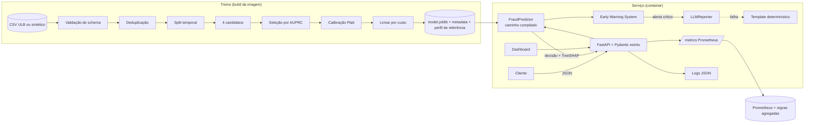

# Software Design Document: FraudGuard

| | |
|---|---|
| Versão | 1.0.0 |
| Status | Pronto para revisão |
| Escopo | Scoring de fraude em tempo real, Early Warning System e relatórios inteligentes |

## 1. Contexto e objetivos

A plataforma processa milhares de transações por minuto. Cada fraude aprovada custa dinheiro e confiança: um cliente que sofre fraude tem motivo para levar o dinheiro para outro banco. Cada cliente legítimo bloqueado também custa: atrito, ligação para a central, e às vezes o mesmo desfecho.

**Objetivos.**
1. Decidir `APROVADO` ou `SUSPEITO` por transação, em milissegundos, minimizando o custo total de fraude.
2. Avisar antes que um ataque ou uma degradação do modelo vire prejuízo (Early Warning System).
3. Traduzir sinais técnicos em comunicação clara para diretoria, operações e engenharia.
4. Tornar cada decisão explicável e cada premissa auditável.

**Fora de escopo nesta versão.** Features de histórico por cartão ou cliente (exigem feature store; ver §10), retreino automático em produção, autenticação da API (responsabilidade do API gateway).

## 2. Requisitos

**Funcionais.** `GET /health` (readiness e liveness); `POST /predict` retornando probabilidade, decisão e latência; validação rigorosa de entrada; logs estruturados; pipeline de transformação exportado junto com o modelo; testes de contrato e de pipeline; container e compose.

**Não funcionais (SLOs).**

| Atributo | Meta | Medido |
|---|---|---|
| Latência de inferência (servidor) p99 | < 50 ms | 0,84 ms |
| Latência ponta a ponta p50, sem saturação | < 10 ms | 2,6 ms |
| Throughput por réplica (1 vCPU) | > 3.000 tx/min | ~22.000 tx/min |
| Disponibilidade | 99,9% | depende da orquestração |
| Erros internos | < 0,1% | 0 em 9.000 requisições de carga |

As medições foram feitas com uvicorn real em 1 vCPU compartilhada entre servidor e gerador de carga (`scripts/benchmark.py`), portanto são conservadoras.

## 3. Arquitetura

**Componentes.**

| Módulo | Responsabilidade |
|---|---|
| `data/` | Carga, validação de schema, deduplicação, split temporal, gerador sintético |
| `features/` | Feature engineering determinístico e pré-processamento (imputação, escalonamento) |
| `modeling/train.py` | Seleção, calibração, limiar, avaliação e artefatos versionados |
| `modeling/predictor.py` | Inferência compilada com verificação de paridade e explicações |
| `modeling/metrics.py` | Métricas de ranking, de classificação e de custo |
| `api/` | Contratos, endpoints, middleware de correlação, métricas e logs |
| `ews/` | Monitor em janela deslizante, PSI, regras de alerta, relatórios via LLM, simulador |
| `analysis/eda.py` | EDA e análise de missing reprodutíveis |

## 4. Pipeline de dados e ML

Cada etapa abaixo nasce de um achado da EDA (`reports/EDA.md`).

| Achado da EDA | Decisão |
|---|---|
| 0,17% de fraudes (1:578) | AUPRC para selecionar e custo para decidir (SDR-001) |
| Nenhum valor ausente no extrato | Imputação por mediana dentro do pipeline mesmo assim (produção terá falhas upstream); a API rejeita nulos |
| 1.082 duplicatas exatas | Deduplicação antes do split (SDR-002) |
| `Amount` com skew de 36; 22% das fraudes são micro-valores ≤ €2 | `log1p` + RobustScaler; flags `amount_is_micro` e `amount_is_zero` |
| Fraude 4,7× mais frequente de madrugada | Hora do dia em codificação cíclica e flag `is_night` |
| `Time` é um contador desde o início da coleta | Descartado como valor bruto: não generaliza |
| Componentes V descorrelacionadas (\|r\| máx. 0,037) | Nenhuma remoção por multicolinearidade |
| Outliers em 70% das fraudes contra 10% das legítimas | Outliers mantidos; escalonamento robusto e árvores |

**Anti-leakage.** Tudo que aprende parâmetros (imputador, scaler, modelo, calibrador) é ajustado apenas na partição adequada. Transformações determinísticas são funções puras por linha. Um teste verifica que as estatísticas do scaler vêm só do treino.

**Artefatos.** `model.joblib` contém o pipeline completo e calibrado (JSON bruto → probabilidade), o modelo base para explicações, o limiar e a versão. `model_metadata.json` registra fonte e fingerprint dos dados, tamanhos das partições, resultados de todos os candidatos, premissas de custo, métricas de teste e versões de bibliotecas. `reference_profile.json` guarda o perfil de validação usado pelo EWS.

## 5. API

| Método | Rota | Descrição |
|---|---|---|
| GET | `/health` | Readiness: 200 com modelo carregado, 503 sem |
| GET | `/health/live` | Liveness: processo respondendo |
| POST | `/predict?explain=` | Probabilidade, decisão, nível de risco, limiar, versão, latência; fatores TreeSHAP opcionais |
| POST | `/predict/batch` | Até 1.000 transações por chamada |
| GET | `/model/info` | Metadados, métricas e premissas do modelo em produção |
| GET | `/ews/status`, `/ews/alerts` | Saúde, janela, PSI, latência, indicadores financeiros e alertas |
| POST | `/ews/report` | Relatório para `executivo`, `operacoes` ou `tecnico` |
| POST | `/ews/simulate`, `/ews/reset` | Somente com `DEMO_MODE=true` |
| GET | `/metrics` | Métricas Prometheus |
| GET | `/` | Dashboard da sala de risco |

Níveis de risco: `BAIXO` (p < limiar/3), `MEDIO` (até o limiar), `ALTO` (acima do limiar) e `CRITICO` (p ≥ max(0,5; 4 × limiar)). O nível permite roteamento operacional (por exemplo, `CRITICO` bloqueia; `ALTO` pede autenticação adicional) sem mudar o contrato binário exigido.

## 6. Early Warning System e relatórios

Ver SDR-009 (regras e PSI) e SDR-006 (LLM). O dashboard mostra, em ordem de importância: estado geral numa faixa colorida, indicadores financeiros, curva da taxa de suspeitas contra o baseline, estabilidade das variáveis, alertas e o relatório inteligente.

## 7. Segurança e privacidade

- Logs sem features nem dados do cliente; apenas ID opaco de transação, probabilidade, decisão e latência.
- O LLM recebe apenas agregados. A saída do LLM é tratada como não confiável: o dashboard escapa todo o HTML antes de renderizar o markdown.
- Container não-root, somente leitura, sem capabilities, com scan de vulnerabilidades no CI.
- `extra="forbid"` impede que dados não previstos entrem no serviço.
- O simulador é desligado por padrão na imagem de produção.

## 8. Escalabilidade e resiliência

- Serviço sem estado de negócio: escala horizontalmente por réplicas. Uma réplica de 1 vCPU sustenta cerca de 22 mil tx/min medidas, então três réplicas cobrem com folga um pico de 10 mil tx/min e toleram a perda de uma.
- Modelo carregado e aquecido no startup; a primeira requisição não paga inicialização.
- Falha ao carregar o modelo deixa a réplica viva mas não pronta (503), evitando reinícios em loop.
- Caminho compilado com fallback automático para o sklearn.
- LLM com timeout, uma nova tentativa e fallback; listeners do EWS isolados por `try/except`.
- `--limit-concurrency 512` protege contra sobrecarga (o excedente recebe 503 rápido em vez de enfileirar indefinidamente).

## 9. Estratégia de testes

122 testes (pytest), cobertura de 91% com gate de 85% no CI.
- **Unitários:** gerador, schema, split, deduplicação, features (incluindo propagação de NaN e ausência de vazamento), métricas de custo contra cálculo manual e força bruta, PSI, regras do EWS, relatórios (fallback, grounding, privacidade do prompt, temperatura), contratos Pydantic, business case.
- **Integração:** treino real em dados reduzidos, artefato autocontido, paridade do caminho rápido e fallback, determinismo, contrato completo da API (sucesso, 422, 413, 503, cabeçalhos, OpenAPI, métricas, dashboard) e fluxo do EWS.
- **Carga:** `scripts/benchmark.py`.
- **Container:** smoke test no CI com usuário e filesystem de produção.

## 10. Riscos e roadmap

| Risco | Mitigação atual | Próximo passo |
|---|---|---|
| Métricas medidas em dados sintéticos | Pipeline idêntico para o CSV real | Rodar com o CSV do Kaggle e revisar SDR-003 e SDR-004 |
| Premissas de custo não validadas | Parâmetros explícitos e baratos de recalibrar | Workshop com Finanças e Risco |
| Poucas fraudes na validação (64) | Calibração sigmoid, conservadora | Validação temporal em janelas com meses de histórico |
| Sem features de comportamento por cartão | Features PCA do dataset | Feature store (Feast) com velocidade, geografia e dispositivo |
| Fraudadores se adaptam (drift adversarial) | EWS e PSI | Retreino periódico, champion/challenger em shadow |
| EWS fragmentado entre réplicas | Regras agregadas no Prometheus | Stream central (Kafka) para análise em nível de frota |
