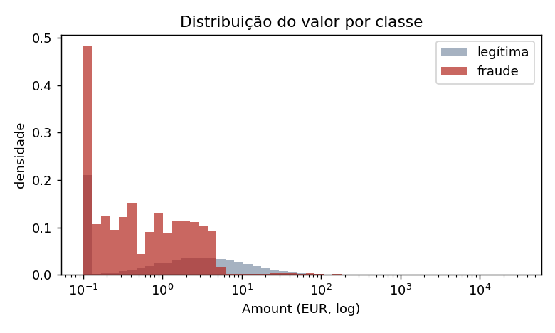
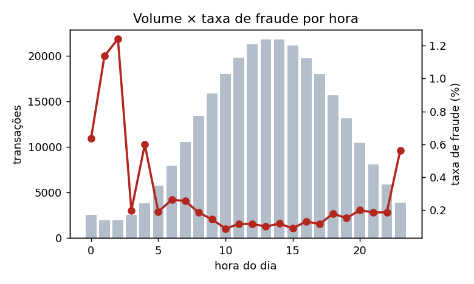
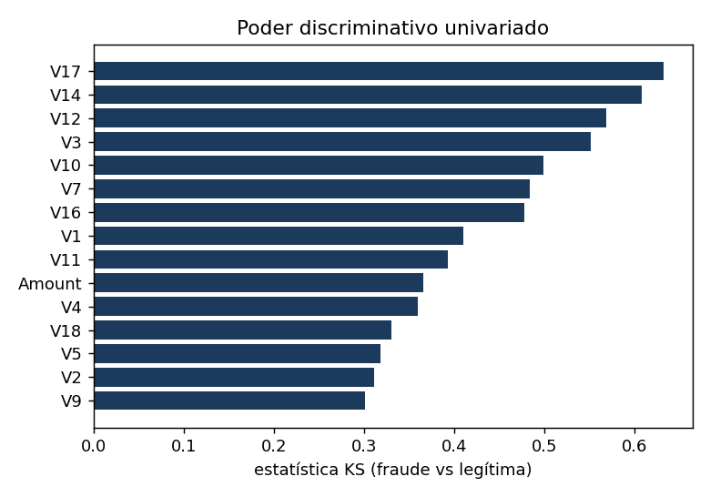

# Análise Exploratória de Dados (EDA)

Fonte: `synthetic:ulb-profile` — 284,807 linhas × 31 colunas.

## 1. Desbalanceamento de classes
- Fraudes: **492** (0.1727%) — razão ≈ 1:578.
- **Decisão:** acurácia é inútil (99,8% prevendo 'tudo legítimo'). Métrica primária = AUPRC; decisão por custo esperado; split temporal estratificado por construção.

## 2. Análise de valores ausentes (Missing Analysis)
- Total de células ausentes: **0** (0.0000%).
- Nenhuma coluna com ausentes. Mecanismo MCAR/MAR/MNAR não se aplica a este extrato.
- **Decisão:** mesmo sem ausentes no treino, produção terá (falhas upstream). `SimpleImputer(median)` dentro do pipeline (ajustado só no treino) + rejeição de nulos na API (Pydantic). Mediana por robustez às caudas pesadas.

## 3. Duplicatas
- Linhas duplicadas exatas: **1,082** (0.380%); fraudes entre elas: 0.
- **Decisão:** deduplicar ANTES do split — cópias em treino e teste inflam métricas (memorização).

## 4. Valor da transação (`Amount`)
| Amount (EUR) | legítima | fraude |
|---|---|---|
| count | 284,315.00 | 492.00 |
| mean | 49.99 | 83.20 |
| std | 122.05 | 163.62 |
| min | 0.00 | 0.01 |
| 50% | 19.95 | 4.80 |
| 90% | 113.13 | 255.42 |
| 99% | 473.93 | 681.03 |
| max | 22,705.92 | 1,670.73 |

- Assimetria (skew) = 36.08; 0.61% das transações têm valor 0.
- Micro-valores (≤ €2): 22.0% das fraudes vs 4.3% das legítimas — assinatura de *card testing*.
- **Decisão:** `log1p(Amount)` + `RobustScaler`; flags `amount_is_zero` e `amount_is_micro`; custo de falso negativo proporcional ao valor.

## 5. Padrão temporal
- Taxa média de fraude na madrugada (0–5h): 0.667% vs dia (8–22h): 0.141% (≈ 4.7×).
- **Decisão:** `Time` bruto é um contador desde o início da coleta e não generaliza; usamos só a hora do dia em codificação cíclica (sin/cos) e a flag `is_night`. Split temporal.

## 6. Poder discriminativo (KS entre classes)
| feature | KS | média_fraude | média_legítima |
|---|---|---|---|
| V17 | 0.633 | -2.763 | -0.002 |
| V14 | 0.608 | -2.779 | -0.001 |
| V12 | 0.569 | -2.646 | -0.001 |
| V3 | 0.551 | -2.828 | 0.004 |
| V10 | 0.499 | -2.191 | 0.000 |
| V7 | 0.484 | -2.376 | 0.026 |
| V16 | 0.478 | -1.798 | -0.002 |
| V1 | 0.411 | -2.142 | -0.003 |
| V11 | 0.393 | 1.392 | 0.000 |
| Amount | 0.366 | 83.202 | 49.995 |

- 4 variáveis com KS > 0,5; 1 com KS < 0,1.
- **Decisão:** sinal forte e não linear em poucas componentes → gradient boosting; as top-KS são monitoradas pelo EWS (drift das variáveis que mais importam).

## 7. Correlação
- |corr| máxima entre componentes V: 0.037 (média 0.0021) — consistente com PCA.
- Maiores |corr| com Amount: V20=0.13, V7=0.10, V10=0.01.
- **Decisão:** sem multicolinearidade; nenhuma remoção de features necessária.

## 8. Outliers
- Linhas com algum valor além de 3×IQR: legítimas 9.93%, fraudes 70.33%.
- **Decisão:** NÃO remover outliers — em fraude, o outlier frequentemente É o sinal. Tratamento via escalonamento robusto e modelo baseado em árvores.

## Figuras

